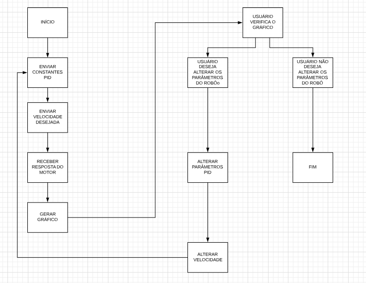

# Efisio

Descrição: Fazer um programa no PC que adquira a resposta do robô a um degrau enviado como velocidade para uma de suas rodas.

Motivação: Melhorar a movimentação dos robôs do projeto de futebol de robôs Very Small Size (VSS), através do cálculo das constantes PID.   

Função: O programa irá enviar uma velocidade para uma das rodas, através da interface USB. Pela mesma interface, o programa irá receber a
velocidade calculada pelo microcontrolador e irá plotar um gráfico que será a resposta do robô a um degrau. Com essa curva gerada, o 
usuário pode extimar as constantes PID do motor.

Fluxograma:

Diagrama de Classes:

Esboço da interface: usando a interface gráfica do LabVIEW, foi criado um esboço de como ficará o projeto:

